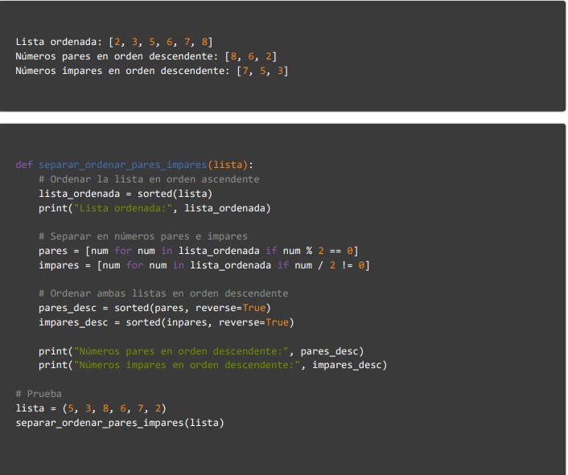

# Trabajo Final

## Curso de Programacion en Python

### Ejercicio N°1:
Las plataformas de música online como YouTube y Spotify almacenan la información asociada a las canciones en
estructuras de datos complejas para hacer las búsquedas de manera eficiente. Para esto se deben modelar las
canciones. Implementar el TDA "Cancion" con los siguientes componentes:
  - Nombre
  - Artista
  - Duración
  - Género musical (6 posibles: Rock, Jazz, Blues, Funk, Reggae y Rap).
  - Año de edición
  - Número de likes
#### Implementar las siguientes operaciones:
  - Constructor: Debe incluir las validaciones necesarias.
  - str: Al usar la función print con una variable del tipo canción debe mostrar: 'nombre' - 'artista' ('duracion').
  - mayorDuracion: Operación que recibe dos canciones por parámetros y retorna la de mayor duración.
  - agregaLikes: Operación que recibe un número e incrementa la cantidad de likes de la canción en ese número.
  - masVotada: Operacion que recibe dos canciones y sin son del mismo artista y del mismo género musical, retorna
la que tiene mayor cantidad de likes. En caso contrario debe lanzar una excepción.

### Ejercicio N°2:
Un número narcisista (o número de Armstrong) es un número que es igual a la suma de sus propios dígitos
elevados a la potencia del número de dígitos. Escribe un algoritmo que averigue si un numero dado es narcisista o
no. Por ejemplo: 153 es un número narcisista porque 1^3 + 5^3 + 3^3 = 153

### Ejercicio N°3:
#### Corregir el código
En el siguiente codigo hay 3 errores que hay que corregir, un error lógico, un error de tipeo y un error de tipo de dato. Se
recibe una lista de numeros y se deben devolver dos listas, una lista con los numero pares y otra con los numeros
impares.
Ejemplo:

